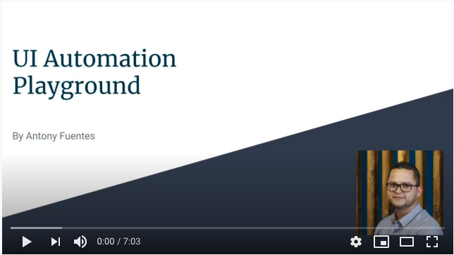

## Intro video:
Click the image below to whatch my intro video
[](https://youtu.be/Z5mt_LNAGc8)


## Project setup:

#### Pre-requisite:
- Clone this repo to your local computer
- **Note:** If you don't have git installed, you can simply download this repo as a ZIP file and unpack it anywhere in your file system

#### Setup option 1 (running Node.js directly in your terminal):
- Download and install node js
- Make sure that Node.js and NPM have been succesfully installed by running the following commands in your terminal:
  - node --version
  - npm --version
- Once the instalation is confirmed, using your terminal cd into the repository folder and run the following 2 commands:
- ```bash
  npm install
  npm start
  ```

#### Setup option 2 (run using docker):
- Install docker on your computer
- Using your terminal, cd into the repository folder and run these 2 commands:
- ```bash
  docker build --tag ui-automation-demo .
  docker run --publish 8080:8080 --detach --name demo ui-automation-demo
  ```
- If you don't know how to install docker on your environment, follow their quick start guide: https://docs.docker.com/get-started/

_Ping me if you have any questions!_

_Have fun :-)_
